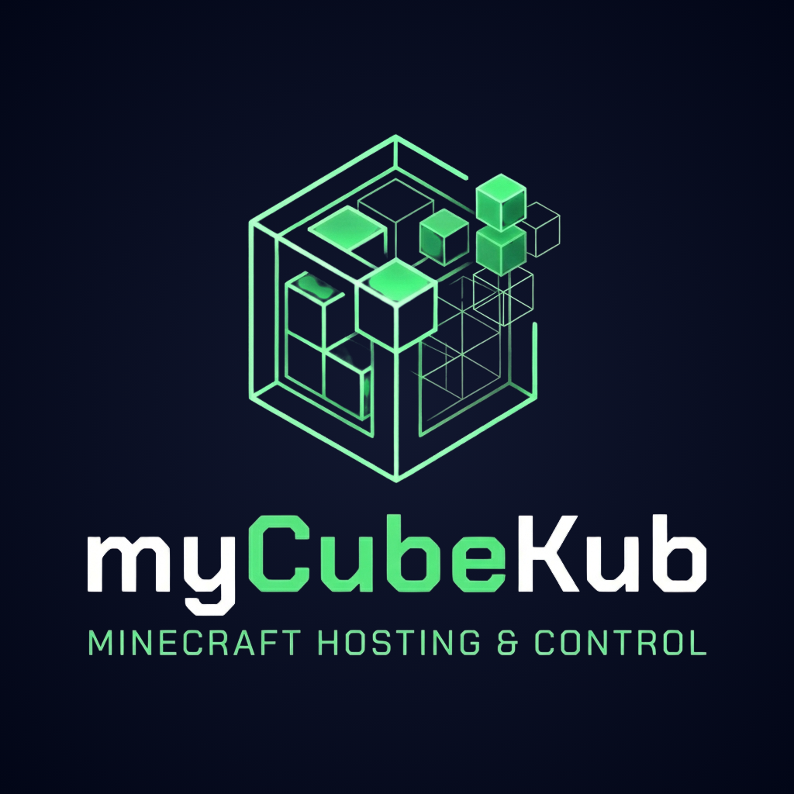
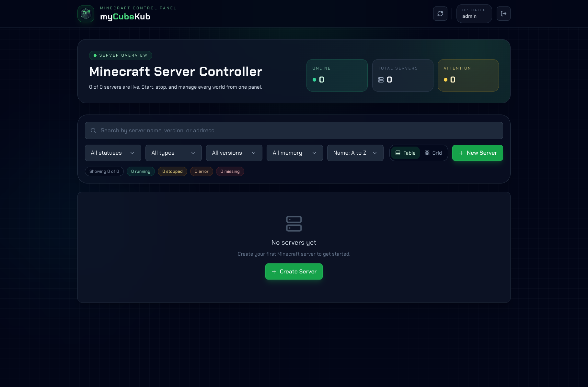
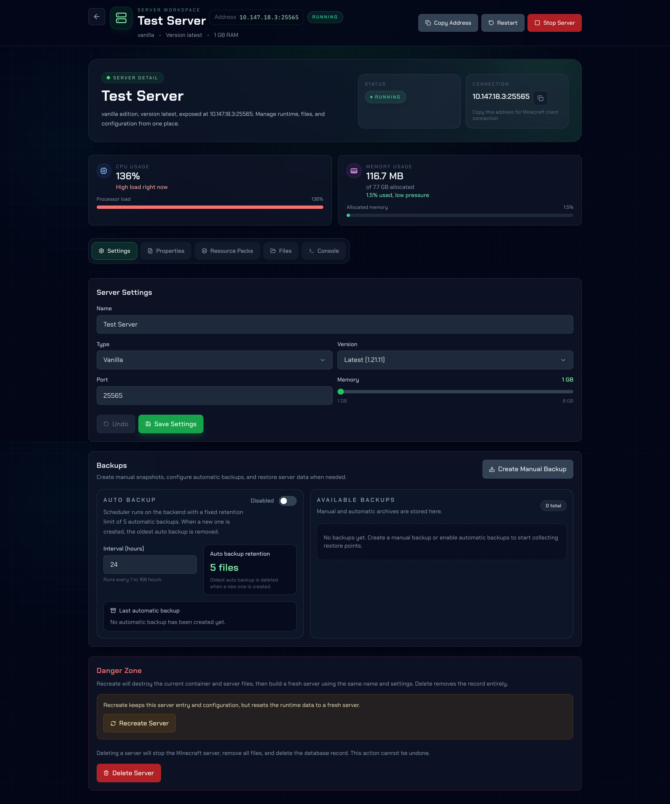
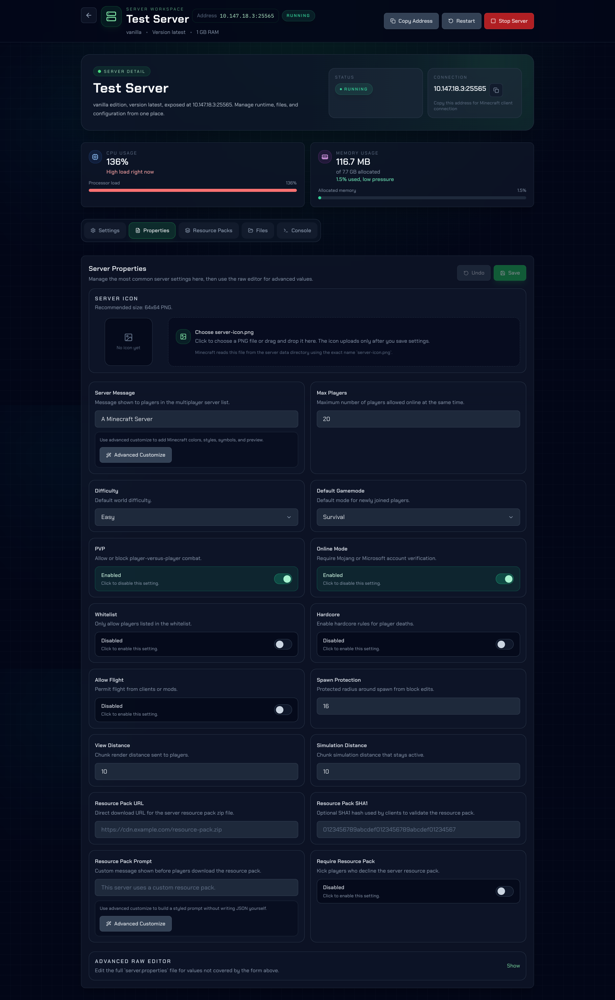
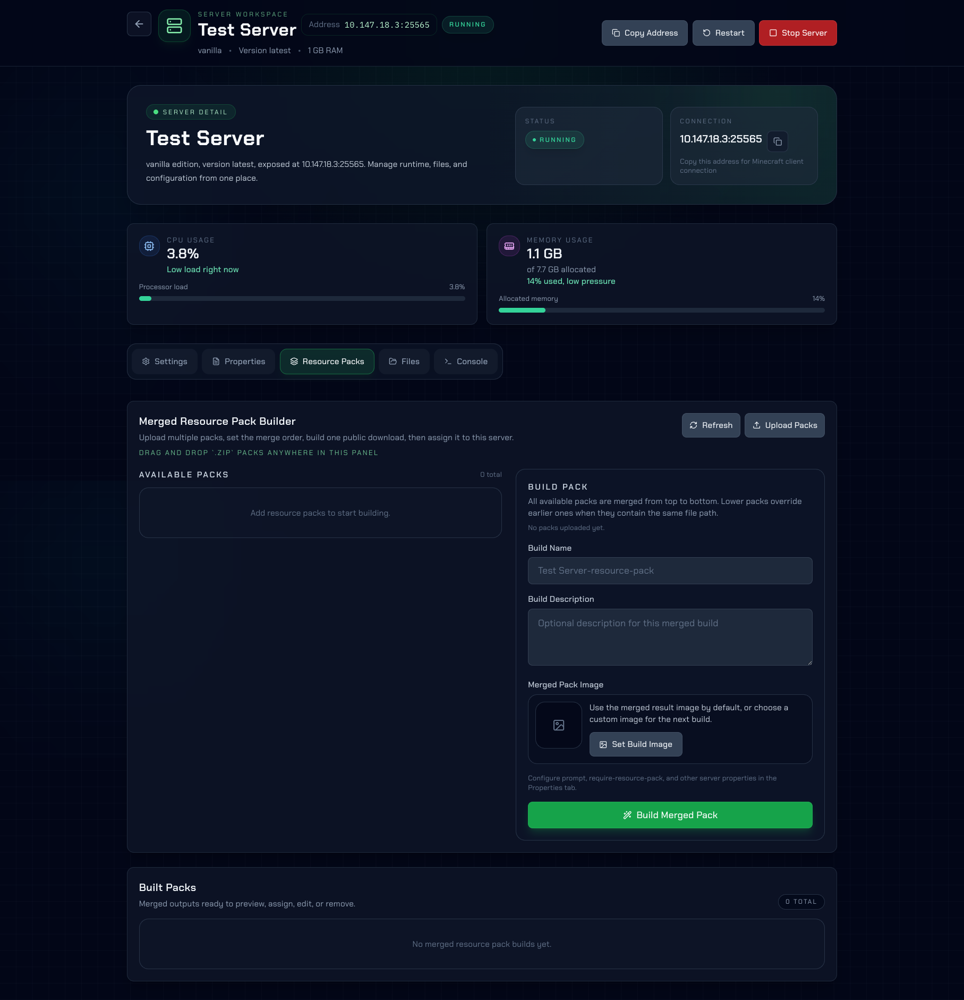
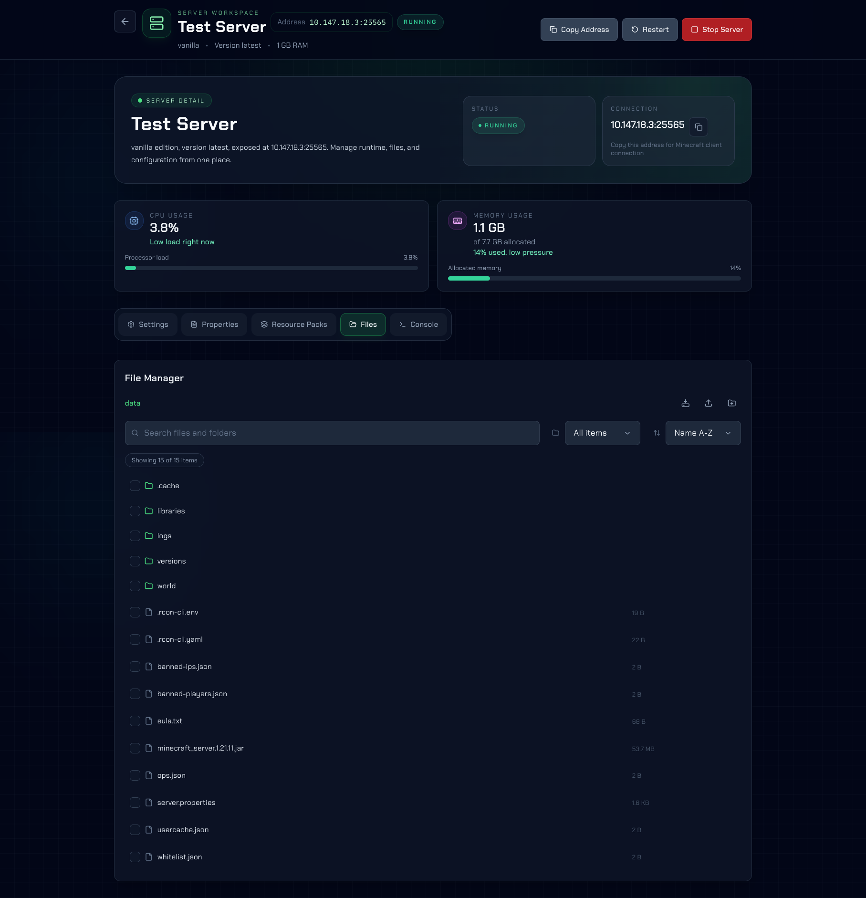
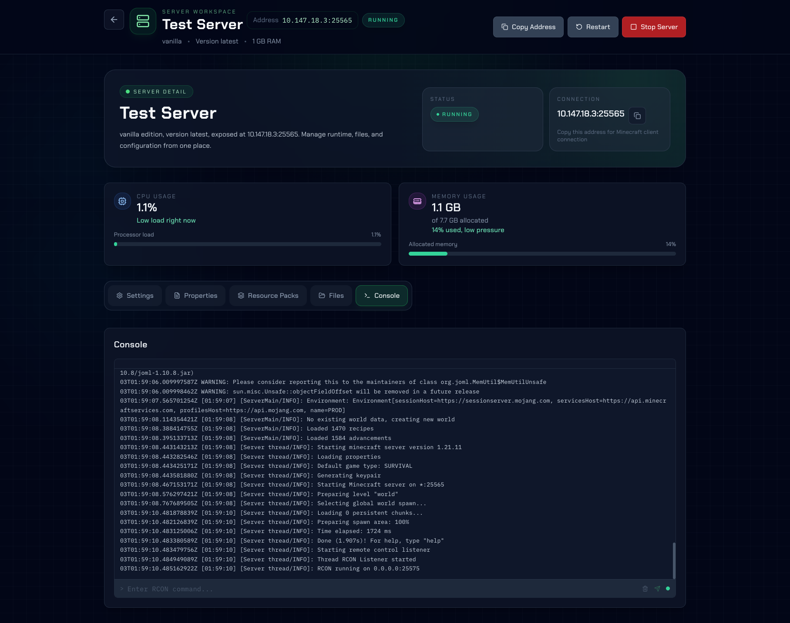

  
  <h1>🧊 myCubeKub</h1>
  
<i>A minimal control panel for managing Minecraft servers from a single web application.</i>

  

    <a href="https://mycubekub.aklkbqx.com"><strong>🌐 App URL:</strong> <code>https://mycubekub.aklkbqx.com</code></a>
  

---

## 🚀 Core Features & Usage

`myCubeKub` simplifies Minecraft server management by hiding complex host operations behind an easy-to-use graphical interface. It allows you to:

- 🎮 **Server Management:** Create, start, stop, restart, and delete Minecraft servers effortlessly.
- ⚙️ **Custom Configuration:** Select server types, versions, ports, and memory configurations through a guided interface.
- 📁 **File Browser:** Manage server files, including `server.properties`, via a built-in file browser.
- 🖥️ **Live Console:** Monitor console logs in real-time and execute commands.
- 📦 **Resource Packs:** Build and manage merged resource packs without manual intervention.
- 💾 **Backups:** Perform manual backups or rely on automated snapshots.
- 📊 **Monitoring:** Monitor basic server metrics like CPU and memory usage.

## ✨ Advantages

- 🎯 **Centralized Management:** Handle all your servers from one dashboard instead of editing files manually on the host.
- ⚡ **Speed & Efficiency:** Create, update, and recover servers faster.
- 🛡️ **Reduced Errors:** Guided settings and clear actions help minimize mistakes.
- 🧰 **All-in-One Solution:** Files, properties, backups, and console are all accessible in the same place.

## 📸 Screenshots

  
  

    
    
    
    
    
  

---

## 📫 Contact

- 🌐 **Website:** [aklkbqx.com](https://aklkbqx.com)
- 📸 **Instagram:** [@akl.kbqx](https://instagram.com/akl.kbqx)
- ✉️ **Email:** [akalakkruaboon@gmail.com](mailto:akalakkruaboon@gmail.com)
- 🐦 **X (Twitter):** [@aklkbqx](https://x.com/aklkbqx)

---

  Built with ❤️ for better Minecraft server management.

